# Лабораторна робота №4-5

## Тема

CI/CD. ХМАРНІ ОБЧИСЛЕННЯ

## Виконання

### Готові посилання

- Посилання на репозиторій: <https://github.com/kiIIer/super-aws-api>
- Посилання на докерхаб репозиторій: <https://hub.docker.com/repository/docker/kiiier/super-aws-api/general>
- Посилання на наш апі в авс(там наш самопідписаний сертифікат, тому будуть казати що небезпечно): <https://ec2-16-16-57-192.eu-north-1.compute.amazonaws.com/>
- Посилання на github pages:

### Налаштування AWS

Для початку створимо інстанс як показано в методичці

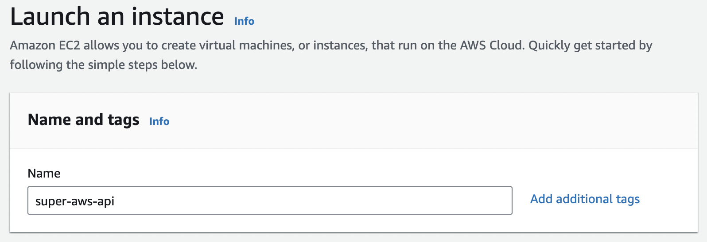

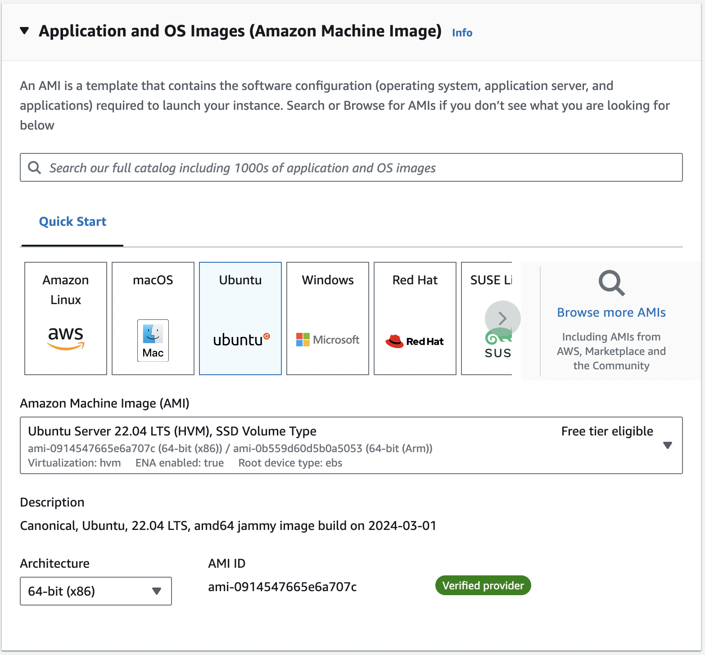

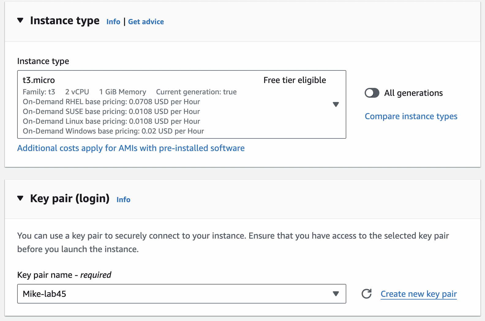

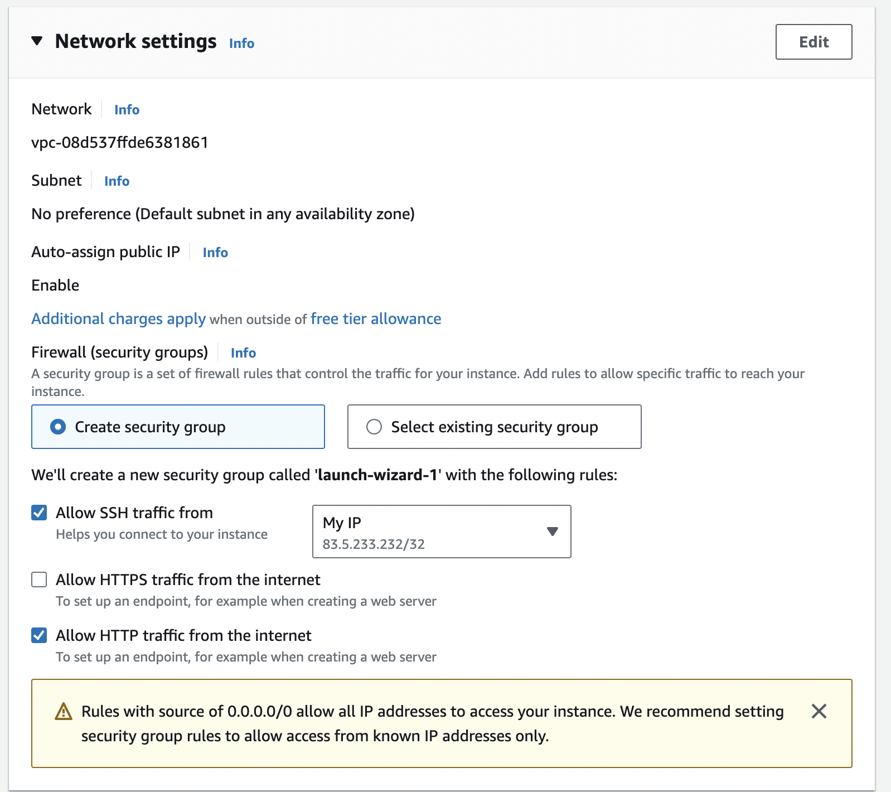

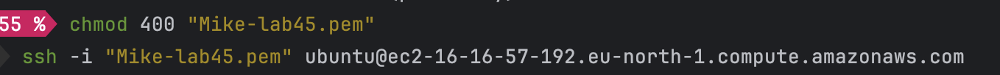

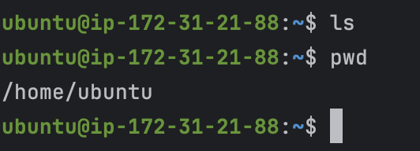

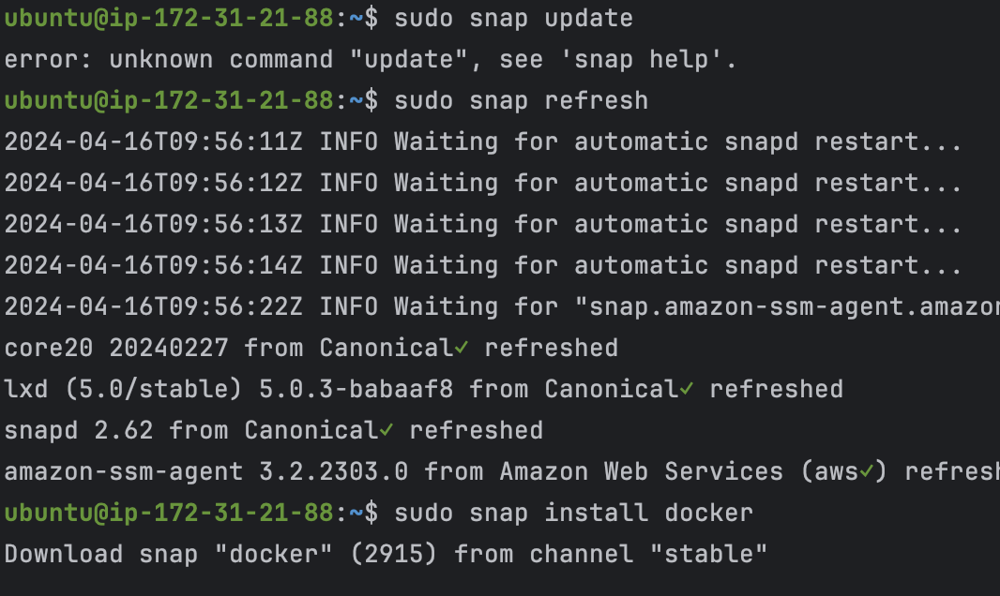

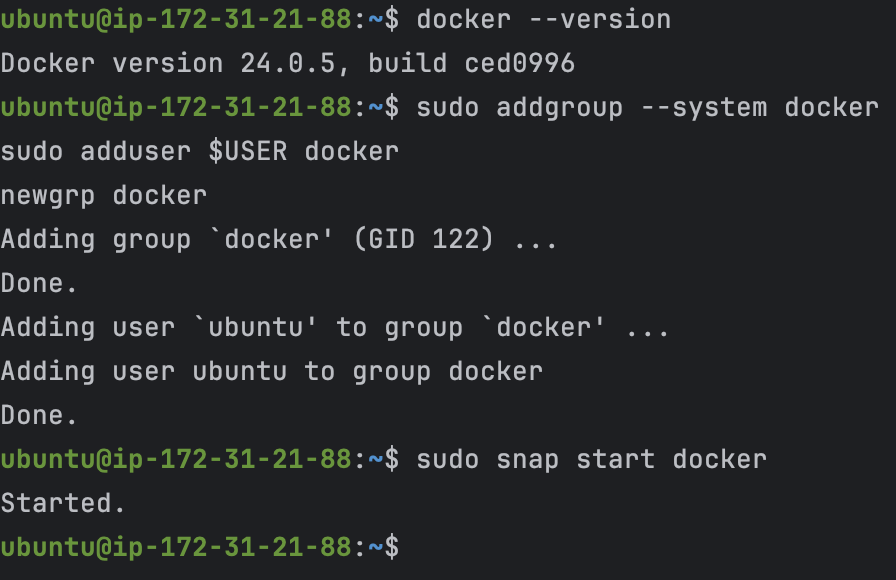

На цьому необхідні налаштування для інстансу були зроблені

### Код та пайплайни

Після створення докерфайлу, застосунок запускався успішно

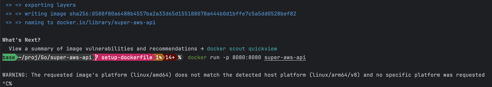

Для коректної роботи Github actions, нам необхідно було додати всі secret-и до менеджера гітхабу та тепер ми можемо їх використовувати як змінні , не показуючи їх нікому

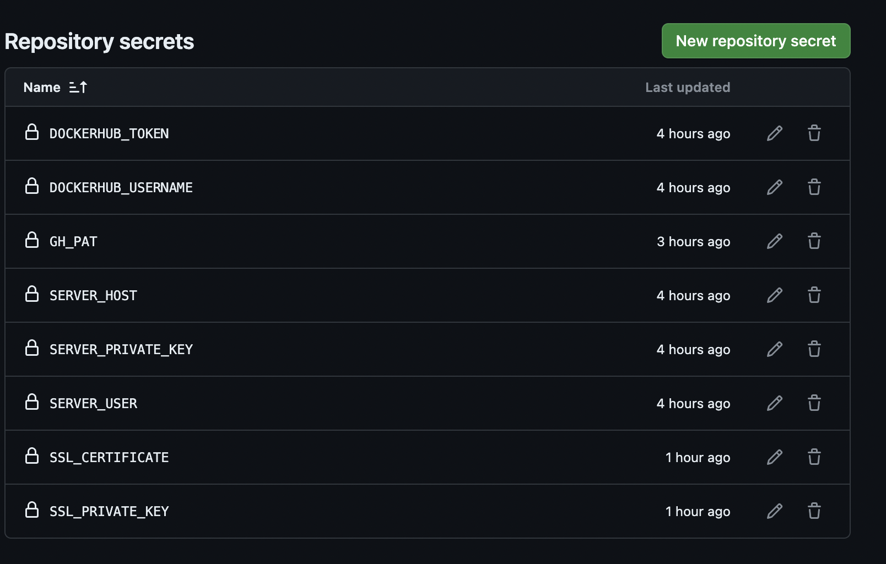

Щоб в main бранчі була тільки робоча версія проекту, вона збирається та тестується в кожному пулл реквесті та його неможливо закрити якщо білд зламався або тести не пройшли

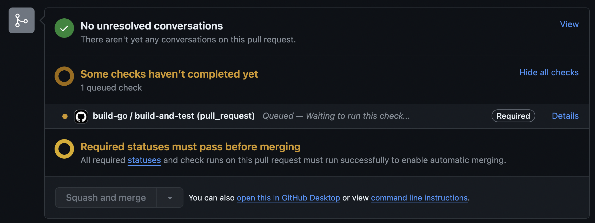

Далі необхідно було зберігати забіджені імеджи в докерхабі, для цього було створено токен на докерхаб репозиторій

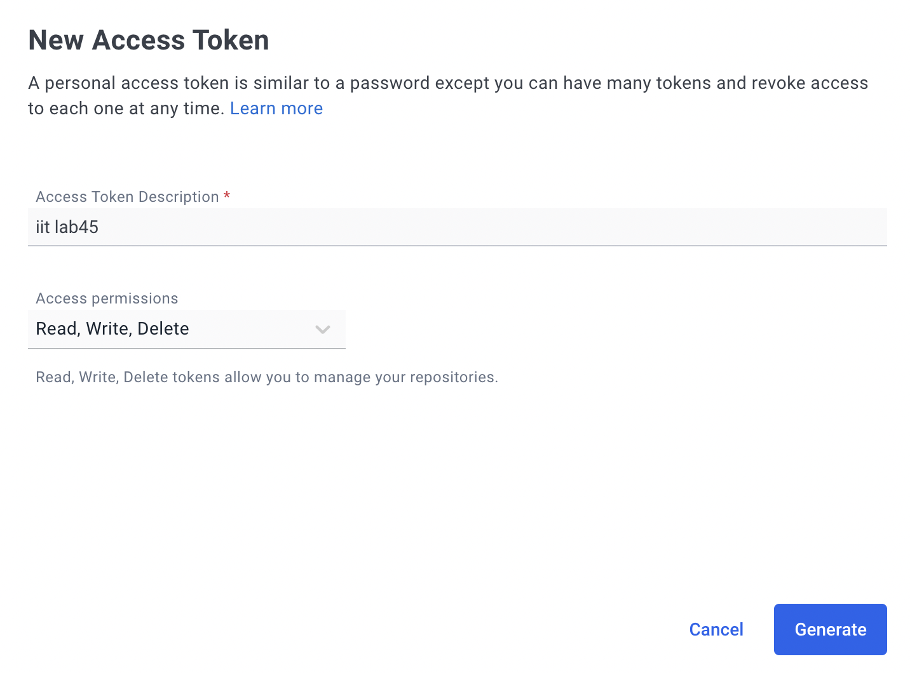

Ось як виглядає сам репозиторій

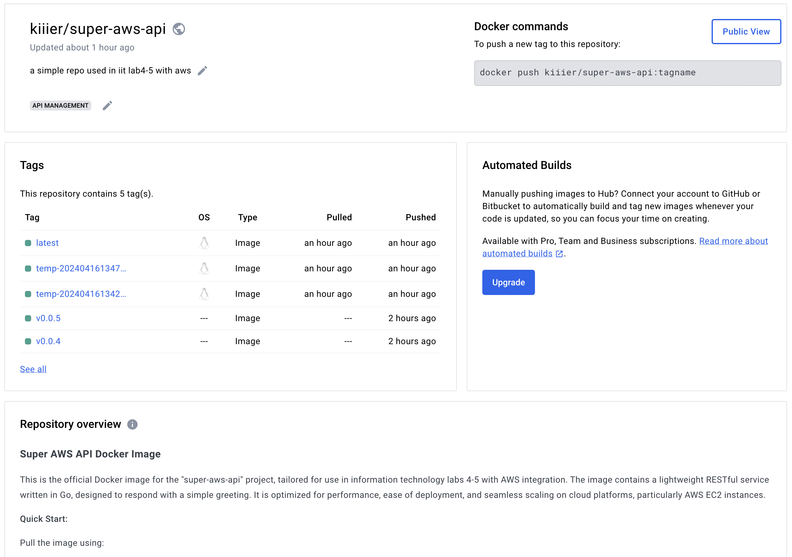

Наступний крок - запускати пайплайни відповідно до кожного оновлення коду, на кожен пулл реквест ми тестуємо, після мерджу ми білдемо імедж та додаємо його до докерхабу з відповідним тегом та тегаєм гітхаб та відповідно до нових тегів у гітхабі оновлюємо код що виконується на авс

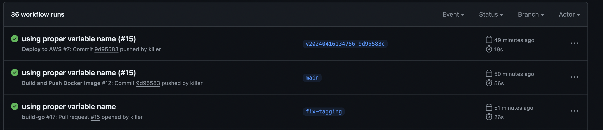

Ось автоматично створений тег в гітхаб, який так само можна знайти в докері

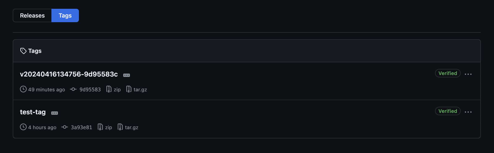

### Сама апі

Після цього всього кожне оновлення коду перевіряється, далі збираєтсья та деплоїться до aws.

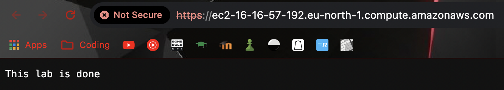

На цьому зображенні бачимо, що дані дійсно оновлюються на інстансі, та є наш сертифікат ssl, але оскільки ми група підпольна, нам не довіряють та кажуть що ми хакери

### Ліцензія

Оскільки ми за open source, ми додали MIT ліцензію, щоб кожен міг брати та використовувати цей код, їсь її текст

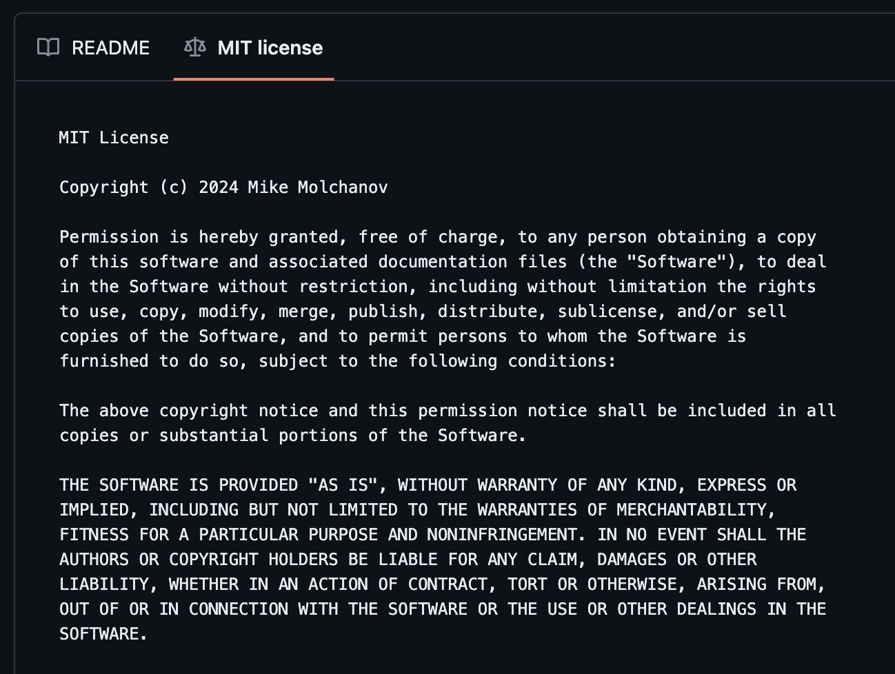

## Висновок

На цій лабораторній роботі ми автоматизували тестування, збір та деплой нашого тестового проекту, Налаштували інстанс в AWS, та змогли до нього під'єднатись. створили пайплайни для тестування, білду та деплою. Використали докерхаб для збереження готових імеджей. Використали сховище гітхабу для сікретів, щоб не дати хакерам проникнути на наші ресурси. Додали SSL сервифікат для https з'єднання. Додали ліцензію щодо використання коду. Створили github pages, щоб все це можна було красиво прочитати
